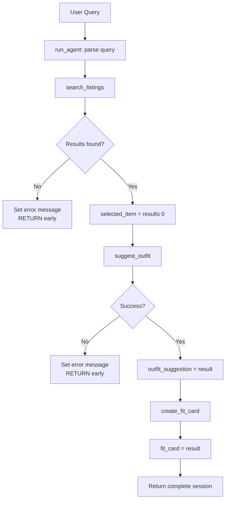

# FitFindr — planning.md

Complete this document before writing any implementation code. Your spec and agent diagram are what you'll use to direct AI tools (Claude, Copilot, etc.) to generate your implementation — the more specific they are, the more useful the generated code will be. Your planning.md will be reviewed as part of your submission. Update it before starting any stretch features.

## Tools

### Tool 1: search_listings

**What it does:** Loads all listings from data/listings.json, filters by size and max_price if provided, then scores each remaining listing by how many keywords from the description appear in its title, description, style_tags, and category fields. Returns results sorted by relevance score, highest first.

**Input parameters:**
- `description (str)`: Natural language keywords describing the item (e.g. "vintage graphic tee"). Used to score listings by keyword overlap.
- `size (str)`: Clothing size to filter by (e.g. "M", "L"). Case-insensitive. Pass None to skip size filtering.
- `max_price (float)`: Maximum price in dollars, inclusive. Pass None to skip price filtering.

**What it returns:** A list of listing dicts sorted by relevance score. Each dict contains: id (str), title (str), description (str), category (str), style_tags (list[str]), size (str), condition (str), price (float), colors (list[str]), brand (str), platform (str). Returns an empty list [] if nothing matches — never raises an exception.

**What happens if it fails or returns nothing:** Returns []. The planning loop checks `if not results` and sets session["error"] to: "No listings found for '[description]' [in size X] [under $Y]. Try broadening your search — remove the size filter, raise the price limit, or use different keywords." The agent returns early and never calls suggest_outfit or create_fit_card.

---

### Tool 2: suggest_outfit

**What it does:** Calls the Groq LLM (llama-3.3-70b-versatile) with the new item's details and the user's wardrobe to generate 1–2 specific outfit combinations. If the wardrobe is empty, it instead prompts the LLM for general styling advice for the piece.

**Input parameters:**
- `new_item (dict)`: A listing dict (as returned by search_listings) for the item the user is considering. Used to pull title, description, style_tags, and colors into the prompt.
- `wardrobe (dict)`: A wardrobe dict with key "items" containing a list of wardrobe-item dicts. Each wardrobe item has: title, category, colors. May be {"items": []}.

**What it returns:** A non-empty string of outfit suggestions (up to ~100 words). If the wardrobe is empty, returns general styling advice for the piece. If the LLM fails, returns a hardcoded fallback suggestion string.

**What happens if it fails or returns nothing:** If new_item is None, returns "[suggest_outfit ERROR] No item provided." If the LLM call fails, returns a template fallback: "Style the [title] with high-waisted bottoms and chunky sneakers for a relaxed, vintage-inspired look." Never raises an exception.

---

### Tool 3: create_fit_card

**What it does:** Calls the Groq LLM with the outfit suggestion and item metadata to generate a short Instagram/TikTok-style caption. Uses temperature=1.0 and a random seed injected into the prompt to ensure outputs vary across calls.

**Input parameters:**
- `outfit (str)`: The outfit suggestion string returned by suggest_outfit. If empty or whitespace-only, returns an error string immediately without calling the LLM.
- `new_item (dict)`: The listing dict for the thrifted piece. Used to pull title, price, platform, and condition into the caption prompt.

**What it returns:** A 2–4 sentence caption string in lowercase with 1–2 emojis, mentioning the item name, price, and platform naturally. Returns a descriptive error string (not an exception) if outfit is empty or new_item is None.

**What happens if it fails or returns nothing:** If outfit is empty: returns "[create_fit_card ERROR] Cannot generate a fit card — outfit description is empty." If LLM fails: returns a template fallback caption using item title, price, and platform. Never raises an exception.

---

## Planning Loop

The agent decides which tool to call next based on what the previous tool returned:

1. Parse the user's natural language query using regex to extract: description (str), size (str or None), max_price (float or None). Store in session["parsed"].

2. Call search_listings(description, size, max_price). Store results in session["search_results"].
   - IF results is empty → set session["error"] to actionable message, RETURN session immediately. Do NOT call suggest_outfit.
   - IF results is non-empty → set session["selected_item"] = results[0], continue to step 3.

3. Call suggest_outfit(session["selected_item"], wardrobe). Store in session["outfit_suggestion"].
   - IF result starts with "[suggest_outfit ERROR]" → set session["error"], RETURN session. Do NOT call create_fit_card.
   - Otherwise → continue to step 4.

4. Call create_fit_card(session["outfit_suggestion"], session["selected_item"]). Store in session["fit_card"].
   - IF result starts with "[create_fit_card ERROR]" → set session["error"].
   - RETURN session.

The agent does NOT call all three tools unconditionally — each step only runs if the previous one succeeded.

---

## State Management

All state is stored in a single session dict created at the start of run_agent() and passed through each step:

| Key | Type | Set when | Used by |
|-----|------|----------|---------|
| "query" | str | Start | Logging |
| "parsed" | dict | After query parsing | search_listings inputs |
| "search_results" | list[dict] | After search_listings | Planning loop branch |
| "selected_item" | dict or None | After non-empty search | suggest_outfit, create_fit_card |
| "wardrobe" | dict | Start | suggest_outfit |
| "outfit_suggestion" | str or None | After suggest_outfit | create_fit_card |
| "fit_card" | str or None | After create_fit_card | UI display |
| "error" | str or None | On any failure | Displayed to user |

The user never re-enters data between steps. selected_item flows from search_listings directly into suggest_outfit, and outfit_suggestion flows from suggest_outfit directly into create_fit_card.

---

## Error Handling

| Tool | Failure mode | Agent response |
|------|-------------|----------------|
| search_listings | No results match the query | Sets session["error"] = "No listings found for '[description]' [in size X] [under $Y]. Try broadening your search — remove the size filter, raise the price limit, or use different keywords." Returns early without calling suggest_outfit or create_fit_card. |
| suggest_outfit | Wardrobe is empty | Detects empty wardrobe["items"] list, switches to a general styling advice prompt instead of a wardrobe-specific one. Returns useful string, never crashes. |
| create_fit_card | Outfit input is missing or incomplete | Returns "[create_fit_card ERROR] Cannot generate a fit card — outfit description is empty." immediately without calling the LLM. |

---

## Architecture

## AI Tool Plan

**Milestone 3 — Individual tool implementations:**
I used Claude as my AI tool. For search_listings, I gave Claude the Tool 1 spec block from this planning.md (input parameter names/types, return value description, failure mode) and asked it to implement the function using load_listings() from utils/data_loader.py. I verified the generated code filtered by all three parameters, returned [] on no results instead of raising an exception, and used load_listings() rather than re-implementing file loading. I then tested it with 3 queries before moving on.

For suggest_outfit, I gave Claude the Tool 2 spec block and asked it to implement using Groq's llama-3.3-70b-versatile. I checked that it handled the empty wardrobe case by switching prompt context rather than crashing, and that LLM errors returned a fallback string.

For create_fit_card, I gave Claude the Tool 3 spec block with the requirement that outputs vary across calls. I verified it guarded against empty outfit strings and used temperature=1.0 with a random seed.

**Milestone 4 — Planning loop and state management:**
I gave Claude the Architecture diagram above plus the Planning Loop and State Management sections. I reviewed the generated run_agent() to confirm: it branched on empty results before calling suggest_outfit, stored values in the session dict between steps, and did not call all three tools unconditionally. I revised the early-return branches to match my spec exactly.

---

## A Complete Interaction (Step by Step)

**Example user query:** "I'm looking for a vintage graphic tee under $30. I mostly wear baggy jeans and chunky sneakers. What's out there and how would I style it?"

**Step 1:**
- Tool: search_listings
- Input: description="vintage graphic tee", size=None, max_price=30.0
- Why this tool: The user wants to find a specific type of item with a price ceiling. search_listings filters the dataset by keyword match and price.
- Output: [{"id":"1", "title":"Faded Band Tee", "price":22.0, "platform":"Depop", "size":"M", "condition":"Good", ...}, ...]
- session["selected_item"] = results[0] (Faded Band Tee)

**Step 2:**
- Tool: suggest_outfit
- Input: new_item=session["selected_item"] (Faded Band Tee dict), wardrobe={"items":[wide-leg jeans, chunky sneakers, black crop top]}
- Why this tool: The user wants to know how to style the item. suggest_outfit uses the item details and wardrobe to generate specific combinations.
- Output: "Pair this faded band tee with your wide-leg jeans and chunky sneakers for a classic 90s grunge look. Tuck the front corner slightly for shape and roll the sleeves once."
- session["outfit_suggestion"] = above string

**Step 3:**
- Tool: create_fit_card
- Input: outfit=session["outfit_suggestion"], new_item=session["selected_item"]
- Why this tool: The user wants a shareable caption. create_fit_card turns the outfit suggestion and item metadata into an Instagram-style post.
- Output: "thrifted this faded band tee off depop for $22 and it was literally made for my wide-legs 🖤 full look dropping in my stories"
- session["fit_card"] = above caption

**Final output to user:** All three panels populated — listing details in panel 1, outfit suggestion in panel 2, shareable caption in panel 3.

**Error path:** If Step 1 returned [] (e.g. "designer ballgown size XXS under $5"), session["error"] is set to an actionable message and the agent returns immediately. Steps 2 and 3 are never called. Panel 1 shows the error, panels 2 and 3 are empty.
